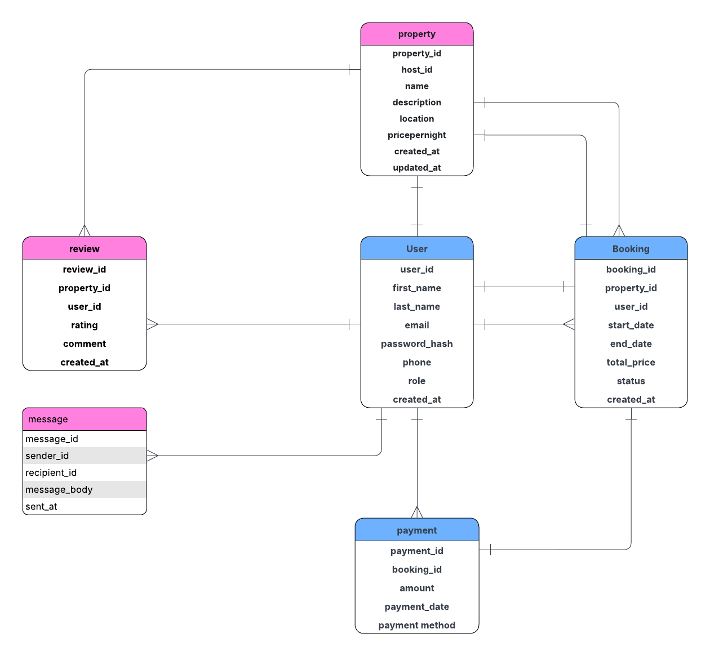

# Airbnb Database ERD

## Entities

- **user**:
user_id: Primary Key, UUID, Indexed  
first_name: VARCHAR, NOT NULL  
last_name: VARCHAR, NOT NULL  
email: VARCHAR, UNIQUE, NOT NULL  
password_hash: VARCHAR, NOT NULL  
phone_number: VARCHAR, NULL  
role: ENUM (guest, host, admin), NOT NULL  
created_at: TIMESTAMP, DEFAULT CURRENT_TIMESTAMP  
- **property**:
property_id: Primary Key, UUID, Indexed  
host_id: Foreign Key, references User(user_id)  
name: VARCHAR, NOT NULL  
description: TEXT, NOT NULL  
location: VARCHAR, NOT NULL  
pricepernight: DECIMAL, NOT NULL  
created_at: TIMESTAMP, DEFAULT CURRENT_TIMESTAMP  
updated_at: TIMESTAMP, ON UPDATE CURRENT_TIMESTAMP    
- **booking**:
booking_id: Primary Key, UUID, Indexed  
property_id: Foreign Key, references Property(property_id)  
user_id: Foreign Key, references User(user_id)  
start_date: DATE, NOT NULL  
end_date: DATE, NOT NULL  
total_price: DECIMAL, NOT NULL  
status: ENUM (pending, confirmed, canceled), NOT NULL  
created_at: TIMESTAMP, DEFAULT CURRENT_TIMESTAMP  
- **payment**: 
payment_id: Primary Key, UUID, Indexed  
booking_id: Foreign Key, references Booking(booking_id)  
amount: DECIMAL, NOT NULL  
payment_date: TIMESTAMP, DEFAULT CURRENT_TIMESTAMP  
payment_method: ENUM (credit_card, paypal, stripe), NOT NULL  
- **review**: 
review_id: Primary Key, UUID, Indexed  
property_id: Foreign Key, references Property(property_id)  
user_id: Foreign Key, references User(user_id)  
rating: INTEGER, CHECK: rating >= 1 AND rating <= 5, NOT NULL  
comment: TEXT, NOT NULL  
created_at: TIMESTAMP, DEFAULT CURRENT_TIMESTAMP  
- **message**: 
message_id: Primary Key, UUID, Indexed  
sender_id: Foreign Key, references User(user_id)  
recipient_id: Foreign Key, references User(user_id)  
message_body: TEXT, NOT NULL  
sent_at: TIMESTAMP, DEFAULT CURRENT_TIMESTAMP  

## Relationships

- **User ↔ Property**  
  - A **User** can be a **host** who owns multiple properties.  
  - Each **Property** belongs to one **host (User)**.  
  - **Relationship type:** One-to-Many (User → Property).

- **User ↔ Booking**  
  - A **User** (as a guest) can make multiple **Bookings**.  
  - Each **Booking** is linked to one **User**.  
  - **Relationship type:** One-to-Many (User → Booking).

- **Property ↔ Booking**  
  - A **Property** can have many **Bookings** over time.  
  - Each **Booking** references one **Property**.  
  - **Relationship type:** One-to-Many (Property → Booking).

- **Booking ↔ Payment**  
  - Each **Booking** has one or more related **Payments** (depending on payment structure).  
  - Each **Payment** is made for one **Booking**.  
  - **Relationship type:** One-to-One or One-to-Many (Booking → Payment).

- **User ↔ Review**  
  - A **User** can write multiple **Reviews**.  
  - Each **Review** is created by one **User**.  
  - **Relationship type:** One-to-Many (User → Review).

- **Property ↔ Review**  
  - A **Property** can receive many **Reviews** from different users.  
  - Each **Review** belongs to one **Property**.  
  - **Relationship type:** One-to-Many (Property → Review).

- **User ↔ Message**  
  - A **User** can send multiple **Messages** and also receive multiple **Messages**.  
  - Each **Message** has a **sender_id** and **recipient_id**, both referencing **User**.  
  - **Relationship type:** Many-to-Many (User ↔ User) through the **Message** entity.

## Diagram
- 
 